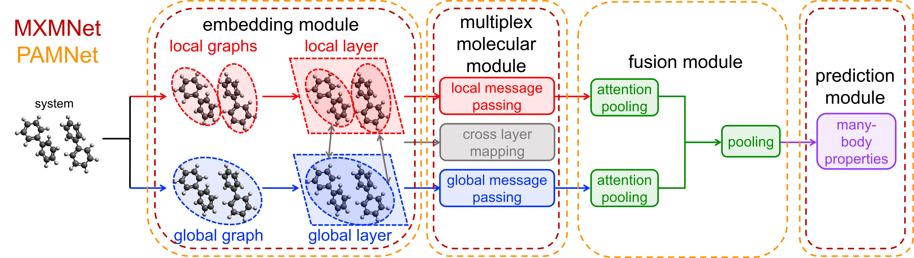

# Integrating Graph Neural Networks and Many-Body Expansion Theory for Potential Energy Surfaces

Code for the FBGNN-MBE in our paper [Integrating Graph Neural Networks and Many-Body Expansion Theory for Potential Energy Surfaces](https://arxiv.org/abs/2411.01578), which has been accepted by the AI for Accelerated Materials Design Workshop ([AI4Mat-NeurIPS 2024](https://sites.google.com/view/ai4mat)) at the 38th Conference on Neural Information Processing Systems ([NeurIPS 2024](https://neurips.cc/Conferences/2024)).

## 📚 Abstract

Rational design of next-generation functional materials relied on quantitative predictions of their electronic structures beyond single building blocks. First-principles quantum mechanical (QM) modeling became infeasible as the size of a material grew beyond hundreds of atoms. In this study, we developed a new computational tool integrating fragment-based graph neural networks (FBGNN) into the fragment-based many-body expansion (MBE) theory, referred to as FBGNN-MBE, and demonstrated its capacity to reproduce full-dimensional potential energy surfaces (FD-PES) for hierarchic chemical systems with manageable accuracy, complexity, and interpretability. In particular, we divided the entire system into basic building blocks (fragments), evaluated their single-fragment energies using a first-principles QM model and attacked many-fragment interactions using the structure–property relationships trained by FBGNNs. Our development of FBGNN-MBE demonstrated the potential of a new framework integrating deep learning models into fragment-based QM methods, and marked a significant step towards computationally aided design of large functional materials.

## Overall Architecture

<p align="center">

</p>

## 🛠 How to Run
Environment:
```
conda env create -f env.yml
```
You can directly download, preprocess the water, phenol, or mixture dataset and train the model with 
```
python train.py --dataset X --n_body X  --n_layer X --cutoff_l X --cutoff_g X (X are numbers)
```
For example (water, 2 body),
```
python train.py --dataset 3 --n_body 2  --n_layer 6 --cutoff_l 1.7 --cutoff_g 5 
```
Optional arguments:
```
  --gpu             GPU number
  --seed            random seed
  --epochs          number of epochs to train
  --lr              initial learning rate
  --n_layer         number of hidden layers
  --n_body          2 for 2body, 3 for 3body
  --dataset         name of the dataset
  --dim             size of input hidden units
  --batch_size      batch size
  --cutoff_l        distance cutoff used in the local layer
  --cutoff_g        distance cutoff used in the global layer
  --model           MXMNet, or PAMNet
```

## ✍ Citation
If you find this model and code are useful in your work, please cite:
```bibtex
@article{chen2024integrating,
  title={Integrating Graph Neural Networks and Many-Body Expansion Theory for Potential Energy Surfaces},
  author={Chen, Siqi and Wang, Zhiqiang and Deng, Xianqi and Shen, Yili and Ju, Cheng-Wei and Yi, Jun and Xiong, Lin and Ling, Guo and Alhmoud, Dieaa and Guan, Hui and others},
  journal={arXiv preprint arXiv:2411.01578},
  year={2024}
}
```
