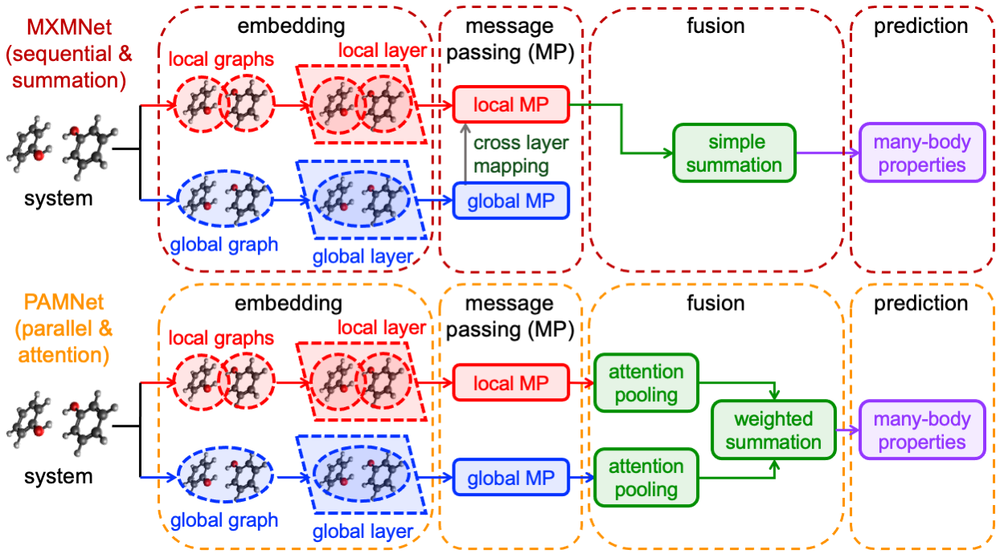

# Integrating Graph Neural Networks and Many-Body Expansion Theory for Potential Energy Surfaces

Code for the FBGNN-MBE in our paper [Integrating Graph Neural Networks and Many-Body Expansion Theory for Potential Energy Surfaces](https://arxiv.org/abs/2411.01578), which has been accepted by the AI for Accelerated Materials Design Workshop ([AI4Mat-NeurIPS 2024](https://sites.google.com/view/ai4mat)) at the 38th Conference on Neural Information Processing Systems ([NeurIPS 2024](https://neurips.cc/Conferences/2024)).

## 📚 Abstract

Rational design of next-generation functional materials relied on quantitative predictions of their electronic structures beyond single building blocks. First-principles quantum mechanical (QM) modeling became infeasible as the size of a material grew beyond hundreds of atoms. In this study, we developed a new computational tool integrating fragment-based graph neural networks (FBGNN) into the fragment-based many-body expansion (MBE) theory, referred to as FBGNN-MBE, and demonstrated its capacity to reproduce full-dimensional potential energy surfaces (FD-PES) for hierarchic chemical systems with manageable accuracy, complexity, and interpretability. In particular, we divided the entire system into basic building blocks (fragments), evaluated their single-fragment energies using a first-principles QM model and attacked many-fragment interactions using the structure–property relationships trained by FBGNNs. Our development of FBGNN-MBE demonstrated the potential of a new framework integrating deep learning models into fragment-based QM methods, and marked a significant step towards computationally aided design of large functional materials.

## Overall Architecture

<p align="center">

</p>

## 🛠 Environment Setup
```
conda env create -f env.yml
```
## 🛠 Single-stage Training
```
python train.py --dataset X --n_body X  --n_layer X --cutoff_l X --cutoff_g X (X are numbers)
```
For example (water, 2 body)
```
python train.py --dataset 3 --n_body 2  --n_layer 6 --cutoff_l 5 --cutoff_g 10 
```
Optional arguments:
```
  --gpu             GPU number
  --seed            random seed
  --model           MXMNet, or PAMNet
  --n_body          2 for 2body, 3 for 3body
  --dataset         name of the dataset
  --epochs          number of epochs to train
  --lr              initial learning rate
  --n_layer         number of hidden layers
  --dim             size of input hidden units
  --batch_size      batch size
  --cutoff_l        distance cutoff used in the local layer
  --cutoff_g        distance cutoff used in the global layer
```
## 🛠 Multi-stage Training
Train mode
```
python train_energy_staged.py --mode train --model X --dataset X --n_body X --n_layer X --dim X --lr_s1 X --lr_s2 X --lr_s3 X --batch_size X --patience X 
```
Predict mode - on test set
```
python train_energy_staged.py --mode predict --model X --dataset X --n_body X --checkpoint ./ckpt/XXX.pt  
```
For example
```
python train_energy_staged.py --mode train --model pamnet --dataset mix --n_body 2 --n_layer 3 --dim 128 --lr_s1 1e-4 --lr_s2 1e-4 --lr_s3 1e-5 --batch_size 128 --patience 50 

python train_energy_staged.py --mode predict --model pamnet --dataset mix --n_body 2 --checkpoint ./ckpt/mix_pamnet_2b_staged/stage_3_FullDataset_ep796_r20.7532.pt  
```
Optional arguments:
```
  --mode                 train or predict
  --model                MXMNet, or PAMNet
  --n_body               2 for 2body, 3 for 3body
  --dataset              name of the dataset
  --n_layer              number of hidden layers
  --dim                  size of input hidden units
  --batch_size           batch size
  --epochs_s1, --lr_s1   Stage 1 epochs and LR
  --epochs_s2, --lr_s2   Stage 2 epochs and LR
  --epochs_s3, --lr_s3   Stage 3 epochs and LR
  --patience             early stopping patience used in each stage
  --checkpoint           required for predict mode
```
## 🛠 Teacher-student knowledge diatillation
Train mode
```
python train_student.py --mode train --dataset X --n_body X  --teacher_checkpoint ./ckpt/XXX.pt  --student_model X --feature_loss_weight X --hidden_dim X --num_layers X
```
Predict mode
```
python train_student.py --mode predict  --student_model X --hidden_dim X --num_layers X  --model_path ./pes_results/model_dimenet_XXX.pt --norm_stats_path ./pes_results/norm_stats_XXX.npy --predict_data_path ../dataset/XXX/XXX.npz
```
For example
```
python train_student.py --mode train --dataset h2o_21 --n_body 2  --teacher_checkpoint ./ckpt/stage_3_FullDataset_ep796_r20.7532.pt  --student_model dimenet --feature_loss_weight 0.01 --hidden_dim 256 --num_layers 2

python train_student.py --mode predict  --student_model dimenet --hidden_dim 256 --num_layers 2  --model_path ./pes_results/model_dimenet_h2o_21_2body_h256_l2_20260415_161002.pt --norm_stats_path ./pes_results/norm_stats_dimenet_h2o_21_2body_h256_l2_20260415_161002.npy --predict_data_path ../dataset/h2o_7/h2o_7_2body_energy_application.npz
```
Optional arguments:
```
  --mode                 train or predict
  --n_body               2 for 2body, 3 for 3body
  --dataset              name of the dataset
  --distill_epochs       number of epochs to distill
  --ft_epochs            number of epochs to fine-tune
  --distill_lr           distillation learning rate
  --ft_lr                fine-tuning learning rate
  --num_layers           number of hidden layers
  --hidden_dim           size of input hidden units
  --batch_size           batch size
  --cutoff_l             distance cutoff used in the local layer
  --cutoff_g             distance cutoff used in the global layer
  --student_model        DimeNet, DimeNet++, VisNet or SchNet
  --feature_loss_weight  λ for feature MSE during distillation)
  --distill_layer        which teacher layer to distill (-1 = last)
  --teacher_checkpoint   Path to the trained teacher model file (PyTorch .pt)
  --model_path           Path to the trained student model file (PyTorch .pt)
  --norm_stats_path      Path to the saved normalization parameters (NumPy .npy)
  --predict_data_path    Path to the prediction dataset (.npz) 
```


## ✍ Citation
If you find this model and code are useful in your work, please cite:
```bibtex
@article{chen2024integrating,
  title={Integrating Graph Neural Networks and Many-Body Expansion Theory for Potential Energy Surfaces},
  author={Chen, Siqi and Wang, Zhiqiang and Deng, Xianqi and Shen, Yili and Ju, Cheng-Wei and Yi, Jun and Xiong, Lin and Ling, Guo and Alhmoud, Dieaa and Guan, Hui and others},
  journal={arXiv preprint arXiv:2411.01578},
  year={2024}
}
```
